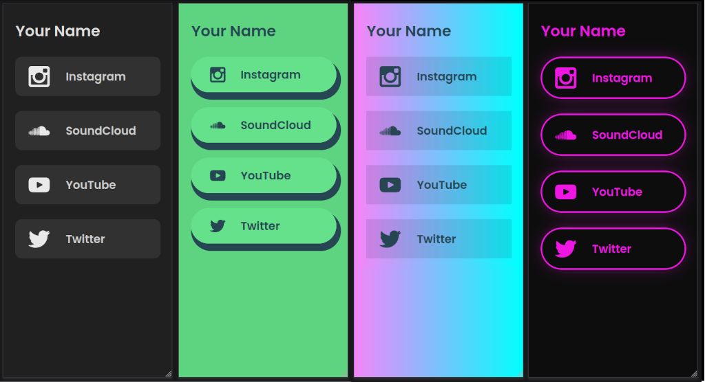

# Linkler

Create customizable Landing Pages for Your Links

<p align="center">
    </img>
</p>

[See Deployed Example](https://links.matiasvlevi.com)

<br/>

### Features

- Strapi CMS
- Google Tag Manager & Google Analitics (Optional)
- SSL (Optional)
- Themes

<br/>

## Configure

Copy the `.env.example` file to `.env` and modify the relevant fields

## SSL (Optional)

If you have an SSL certificate and private key, you can put the files in the `./linkler-frontend/ssl/` directory.

| file                 | location                          |
| -------------------- | --------------------------------- |
| Private key          | `./linkler-frontend/ssl/key.pem`  |
| Certificate          | `./linkler-frontend/ssl/cert.pem` |
| CA bundle (optional) | `./linkler-frontend/ssl/ca.pem`   |

If no files are found in the SSL directory, the server will host as a regular HTTP server

## Themes

[Configure themes](./docs/THEMING.md)

## Build

```
docker compose build
```

```
docker compose up
```

Once up, you can access the link page at `http://127.0.0.1:WEB_PORT` and the admin dashboard at `http://127.0.0.1:WEB_PORT/admin`

<br/>

---

### Notes

You might want to add `find` and `findOne` permissions to `links` and `meta` apis in the strapi Role Settings.
This is planned to be bootstrapped by default in the next versions.
