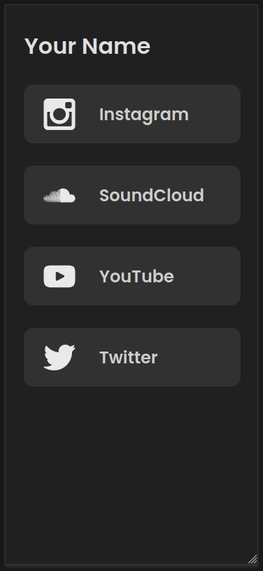
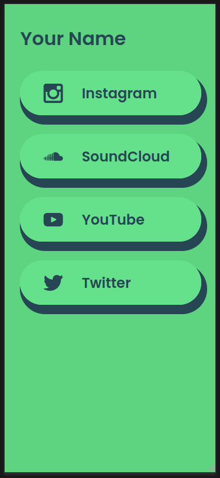
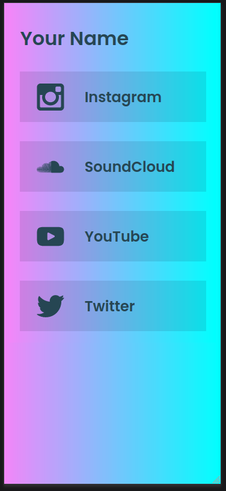
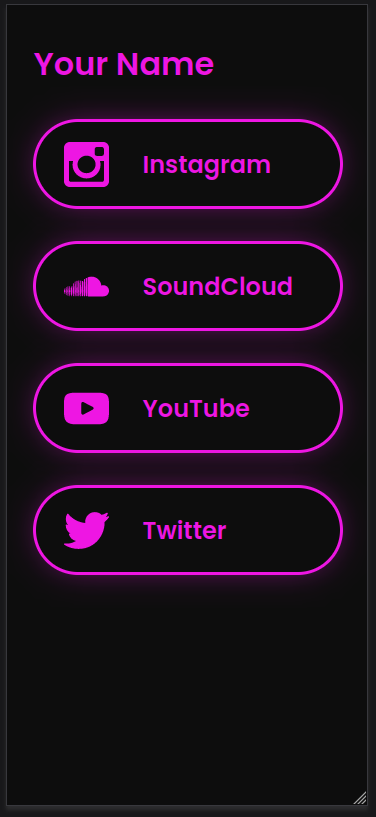

# Theming

Set the theme name in the linkler configuration file found in `./linkler-frontend/.linklerrc.js`

<br/>

## Current themes

### Classic

</img>

### Clicky

</img>

### Cloud

</img>

### Neon

</img>

<br/>

## Custom Theme

Create your a stylesheet under `./linkler-frontend/themes/your_theme_name.css`

This is the link markup generated dynamically

```html
<div class="link">
  
  <div class="content">
    <h2 class="title">My Link</h2>
    <p class="description">Sample text</p>
  </div>
</div>
```

Use your theme's CSS file name without the extention as the theme name in the configuration file
